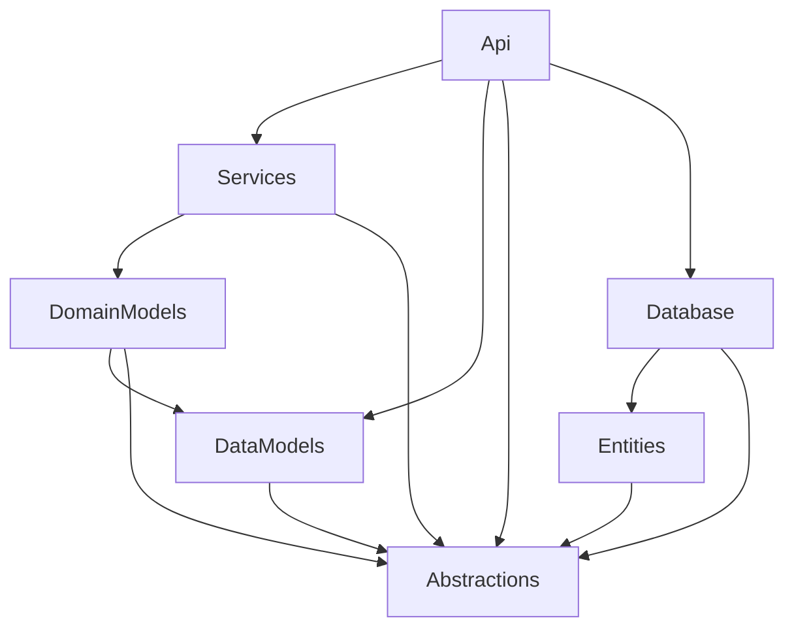

# Northstar .NET Backend Architecture Guide

This document outlines the architectural decisions for the Balenthiran .NET backend. This structure is intended to be used as a template for future projects in the ecosystem.

## Project Structure (7-Project Pattern)

```text
Balenthiran/
├── Balenthiran.Api           # Entry point, Routes, API Models (Data Models)
├── Balenthiran.Services      # Orchestration, Business Logic implementations
├── Balenthiran.DomainModels  # Domain Logic, Model extensions (Rich Domain Model)
├── Balenthiran.Database      # DbContext, Migrations, Repository implementations
├── Balenthiran.DataModels    # API DTOs / POCOs (Data Models)
├── Balenthiran.Entities      # EFCore Database Entities (Anemic/POCO)
└── Balenthiran.Abstractions  # Interfaces for Services and Domain/Data Models
```

## Core Architectural Principles

### 1. DRY through Model Extension
**Problem**: In many architectures, DTOs (Data Models) and Domain Models end up being identical POCOs, leading to redundant code and mapping overhead.
**Solution**: Domain Models in `Balenthiran.DomainModels` extend Data Models from `Balenthiran.DataModels`. 

**Naming Convention**:
- **Data Models**: `User` / `IUser` (Clean POCO for contract)
- **Domain Models**: `DomainUser` / `IDomainUser` (Extends Data model with methods)

- **Reasoning**: This maintains DRY (Don't Repeat Yourself) while providing a crystalline separation in the code. Prefixing domain objects with `Domain` ensures that there is no confusion when both are used in a mapping service.

### 2. Interface-Driven Development & DI
- **Service Isolation**: The `Api` project only interacts with service **interfaces** defined in `Abstractions`.
- **Dependency Injection**: Services are registered and injected into Minimal API routes.
- **Contract Safety**: Service methods accept and return interfaces (e.g., `Task<IDomainUser>`) rather than concrete implementations. This ensures the API layer isn't coupled to specific logic implementations.

### 3. Separation of Persistence (Entities vs Models)
- **Entities**: Located in `Balenthiran.Entities`, these follow EFCore requirements (primary keys, navigation properties). They do not implement interfaces as they are tightly coupled to the persistence schema.
- **Database Layer**: `Balenthiran.Database` contains the `DbContext` and is the only project concerned with how data is physically stored.
- **Mapping**: Transitions between `Entities` and `Domain/Data` models occur within the Services or specialized mapping profiles, ensuring the business logic remains "Database Agnostic".

### 4. Deterministic Codegen
- **OpenAPI/Swagger**: The `Api` project serves as the source of truth for the frontend.
- **hallucination-Reduction**: By using a code generator on the frontend to read the `openapi.json`, we ensure TypeScript services and types are always in sync with the .NET implementation, reducing the risk of runtime errors or AI-generated hallucinations during development.

## Dependency Graph


